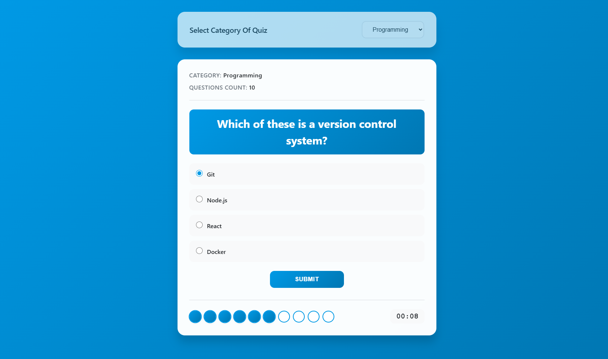

# Advanced Quiz App 

An interactive, feature-rich quiz application built with modern web technologies. Test your knowledge across multiple categories with a timed experience and visual progress tracking.

##  Features

###  Multiple Categories
- **Programming** 
- **History** 
- **Science** 
- **Animals** 
- **Sports** 

### ⏱ Timer System
- 10-second countdown per question
- Automatic progression to next question if time expires
- Visual timer display with urgency indication

###  Progress Tracking
- Interactive bullet system showing answered/unanswered questions
- Current question indicator
- Real-time score tracking

###  User Experience
- Modern, responsive design
- Smooth animations and transitions
- Dark mode support (system preference)
- Mobile-friendly interface
- Accessible keyboard navigation

###  Results Display
- Final score calculation
- Performance-based feedback (Bad/Good/Very Good)
- Category-specific results
- Option to retry with different categories

##  Live Demo

[View Live Demo](#) *(Add your demo link here)*

##  Technologies Used

| Technology 
| **HTML5** 
| **CSS3** 
| **JavaScript (ES6+)** 
| **Google Fonts** 

## Screen Shot

;

## Live Demo

<a href="https://advanced-quiz-app.netlify.app/">live demo</a>
