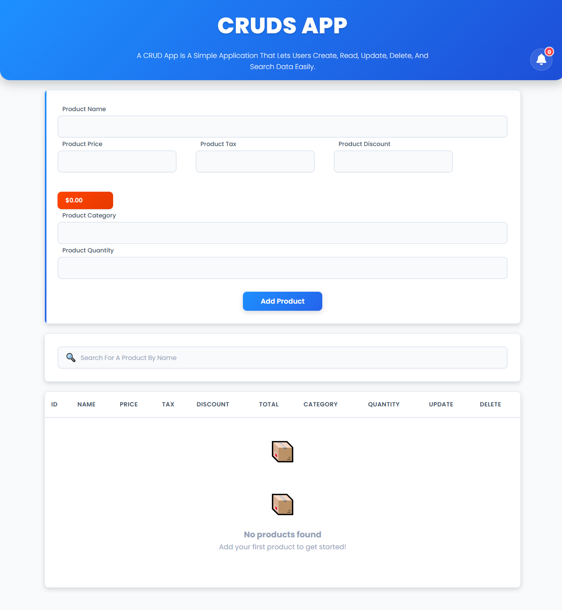

# CRUDs App 🧾

A simple CRUDs (Create, Read, Update, Delete) application built with Vanilla JavaScript to manage products efficiently.

## 🚀 Features
- Add new products
- Display products in a table
- Update existing products
- Delete single or all products
- Search products by title or category
- Data persistence using LocalStorage

## 🛠️ Technologies Used
- HTML5
- CSS3
- JavaScript
- DOM (Document Object Model)
- BOM (Browser Object Model)
- LocalStorage

## 📸 Screenshot

## 🌐 Live Demo
👉 https://your-live-demo-link.com

## 📂 Project Structure
