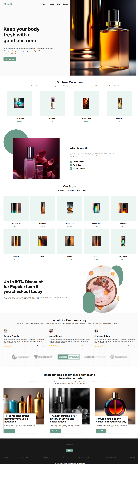

# 🌸 Perfume Website

A modern and fully responsive perfume website built using **HTML, CSS, and JavaScript**.  
The website showcases different types of perfumes with a clean UI, smooth user experience, and strong SEO optimization.

---

## 🚀 Features

- 📱 Fully Responsive Design (Mobile, Tablet, Desktop)
- 🎨 Clean and Modern UI
- 🛍️ Display of Different Perfume Types
- ⚡ Fast Loading Performance
- 🔍 SEO Optimized Structure
- 🧭 Easy Navigation
- 💡 Well-structured and readable code

---

## 🛠️ Technologies Used

- **HTML5** → Structure of the website  
- **CSS3** → Styling and layout (Flexbox & Grid)  
- **JavaScript (Vanilla JS)** → Interactivity and dynamic behavior  

## 📸 Screenshot

