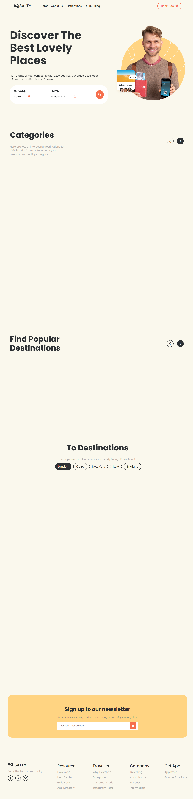

# 🌍 Travel Website

A modern and responsive travel website designed to make travel journeys easier and more enjoyable.  
The website provides a clean UI, smooth animations, and a fully responsive layout across all devices.

---

## ✨ Features

- 🧭 User-friendly travel website design
- 📱 Fully responsive (Desktop, Tablet, Mobile)
- 🎬 Smooth scroll animations using ScrollReveal
- ⚡ Fast and lightweight (Vanilla JavaScript only)
- 🎨 Clean and modern UI

---

## 🛠️ Technologies Used

- **HTML5** – Structure and semantic markup  
- **CSS3** – Styling, layout, and responsiveness  
- **JavaScript (ES6)** – Interactivity and dynamic behavior  
- **ScrollReveal.js** – Scroll-based animations  

---

## 📸 Screenshot

