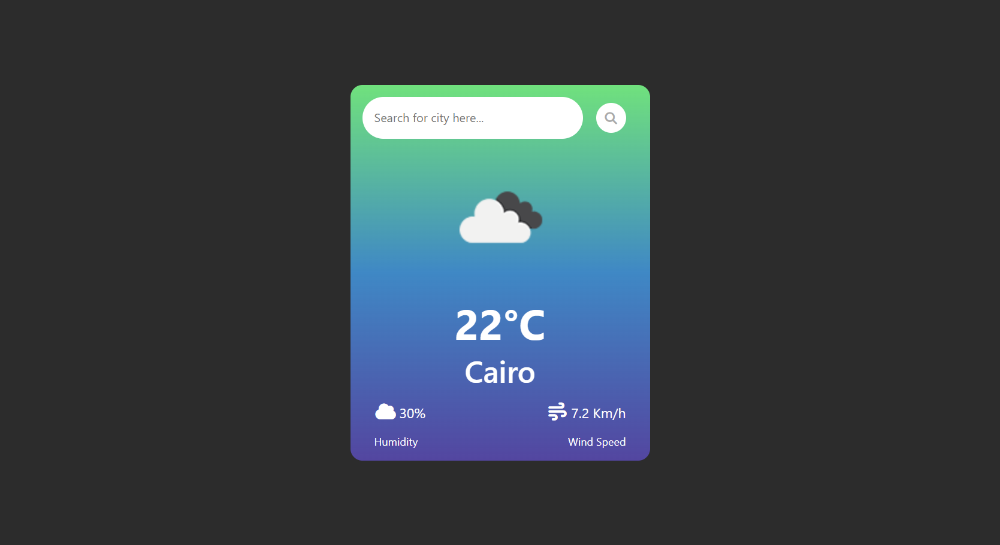

# Weather App 

A modern, responsive weather application that provides real-time weather data for any city worldwide. Built with HTML5, CSS3, and JavaScript (ES6), featuring a clean interface and detailed weather information.

## Live Demo

<a href="https://eg-weather-app.netlify.app/">live demo</a>

## Screen Shot

##  Features

###  Core Features
- **Search Any City** - Get weather data for cities worldwide
- **Real-time Data** - Current temperature, humidity, wind speed, and conditions
- **Dynamic Icons** - Weather-specific icons that change based on conditions
- **Recent Searches** - Quickly access previously searched cities
- **Responsive Design** - Works perfectly on all devices

###  Weather Information Display
- Current temperature
- "Feels like" temperature
- Humidity percentage
- Wind speed and direction

##  Technologies Used

| Technology
|------------
| **HTML5**
| **CSS3**
| **JavaScript (ES6+)**
| **OpenWeatherMap API**
| **Font Awesome**
| **Google Fonts**
