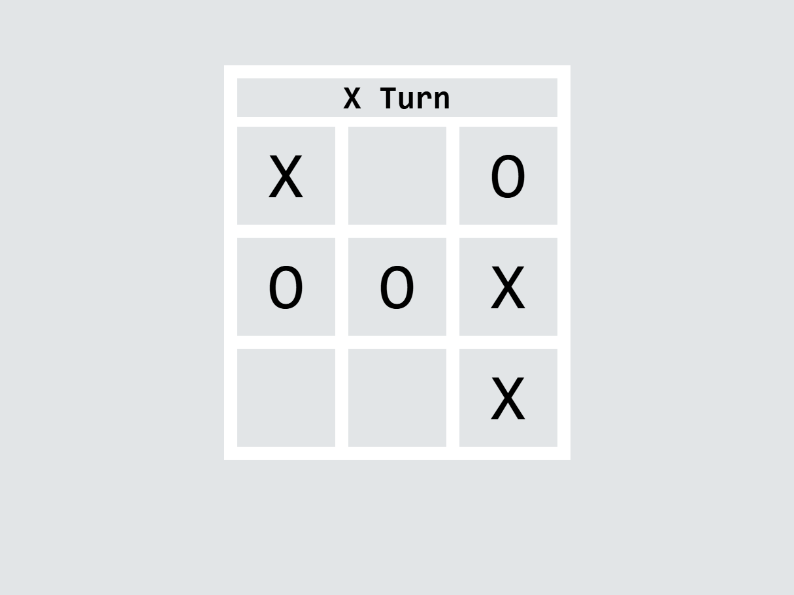

# 🎮 X-O Game (Tic-Tac-Toe)

A simple **X-O (Tic-Tac-Toe)** game built using basic web technologies.  
Players can play against each other on the same device.

---

## 🚀 Technologies Used

- HTML – Structure of the website
- CSS – Styling and layout
- JavaScript – Game logic and interactivity

---

## 🎯 Features

- Simple and clean design 🎨
- Two players game (X and O) 🎮
- Automatic winner detection 🏆
- Restart game option Automatically

---
## 📸 Game Rules

- The game is played between two players (X and O).
- Players take turns placing their marks.
- The first player to get 3 in a row wins.
- If all squares are filled without a winner, the game is a draw.

---

## Screenshot

## 👨‍💻 Author

Mohamed Zenhom